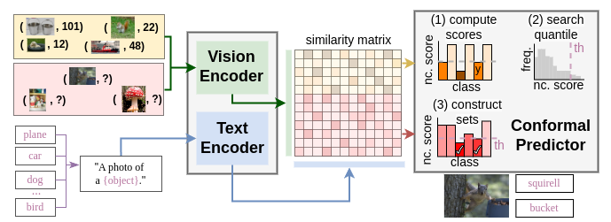

# Conformal Prediction for Vision-Language Models

 <br/>

The official implementation of [*Conformal Prediction for Zero-Shot Models*](https://arxiv.org/abs/2505.24693).<br/>
📜 <span style="color:red">*IEEE/CVF Conference on Computer Vision and Pattern Recognition*</span> \
[Julio Silva-Rodríguez](https://scholar.google.es/citations?user=1UMYgHMAAAAJ&hl),
[Ismail Ben Ayed](https://scholar.google.es/citations?user=29vyUccAAAAJ&hl),
[Jose Dolz](https://scholar.google.es/citations?user=yHQIFFMAAAAJ&hl) ⋅ ÉTS Montréal
<br/>
| [Project](https://jusiro.github.io/projects/confot) | [Conference](https://openaccess.thecvf.com/content/CVPR2025/papers/Silva-Rodriguez_Conformal_Prediction_for_Zero-Shot_Models_CVPR_2025_paper.pdf) | [ArXiv](https://arxiv.org/abs/2505.24693) | [Code](https://github.com/jusiro/CLIP-Conformal) |
<br/>


### Install

* Install in your enviroment a compatible torch version with your GPU. For example:

```
conda create -n clipconformal python=3.11 -y
conda activate clipconformal
conda install pytorch==2.0.1 torchvision==0.15.2 torchaudio==2.0.2 pytorch-cuda=11.7 -c pytorch -c nvidia
```

```
git clone https://github.com/jusiro/CLIP-Conformal.git
cd CLIP-Conformal
pip install -r requirements.txt
```

### Preparing the datasets
- Configure data paths (see [`./local_data/constants.py`](./local_data/constants.py)).
- Download, and configure datasets (see [`./local_data/datasets/README.md`](./local_data/datasets/README.md)).

## Usage
We present the basic usage here.

(a) Zero-shot logit extraction:
- `python extract_logits.py --backbone CLIP-RN50 --test_datasets dtd,ucf`

(b) Conformal inference with no adaptation:
- `python conformal_prediction.py --backbone CLIP-RN50 --test_datasets dtd,ucf --adapt none --alpha 0.10 --ncscore aps`

(c) Conformal inference using the proposed transductive method, Conf-OT:
- `python conformal_prediction.py --backbone CLIP-RN50 --test_datasets dtd,ucf --adapt confot --alpha 0.10 --ncscore aps`

You will find the results upon training at [`./local_data/results/`](./local_data/results/).

## Additional options

Please, inspect the input options in [`conformal_prediction.py`](conformal_prediction.py) for more details on:
- Additional datasets.
- Additional backbones CLIP (RN101, ViT-B/32, ViT-B/16, ViT-L/14) and MetaCLIP (ViT-B/16, ViT-H/14).
- Non-conformity scores (LAC, APS, RAPS).


## Citation

If you find this repository useful, please consider citing this paper:
```
@inproceedings{confot25,
    author    = {Silva-Rodríguez, Julio and Ben Ayed, Ismail and Dolz, Jose},
    title     = {Conformal Prediction for Zero-Shot Models},
    booktitle = {Proceedings of the Computer Vision and Pattern Recognition Conference (CVPR)},
    month     = {June},
    year      = {2025},
    pages     = {19931-19941}
}
```
